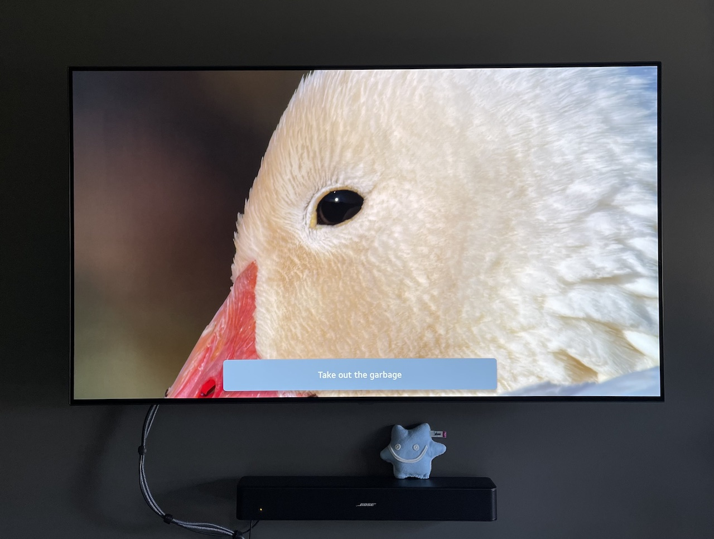

# LGTVMessenger

## What in the...

Have you ever needed to send a message to someone in another room of your house who was watching TV with headphones on but wasn't great at checking their phone?  Or maybe you just want to annoy the everliving crap out of your spouse?  Then this app might be for you.  Run it on a server in your house, connect to it from your phone, and have fun spamming your friends and family for years to come!

### Example

### Notes

- This service *must* be run on the same network as the TVs you wish to message.  You cannot run this on a remote service like a droplet or AWS.
- If you decide to expose this service to the world (e.g. via some kind of port forward), be aware that anyone who accesses the page will have unfettered access to the bottom of your TVs forever.  If you absolutely must expose it to the internet, use something like a Cloudflare tunnel and then create a Cloudflare Access application, and only allow certain email addresses to browse to it (this is an exercise left up to the reader; PRs for better documentation are greatly appreciated.)

## Requirements

This app requires PHP, NodeJS *and* Python.  You must have the following versions:

|Software|Version|
|--------|-------|
|PHP     |8.2    |
|Python  |3.11.4 |
|NodeJS  |20.5.0 |

## Instructions

1. Run `composer install`, `npm install`, and `npm run build`
2. Run `php artisan lg:first-time`
3. Open the newly created `.env` file, and update the `APP_URL` fields to appropriate values
4. Point your web server's root directory to the `/public` folder in this distribution.

If you ever need to add another TV to the list, you can run `php artisan lg:add` and follow the prompts
